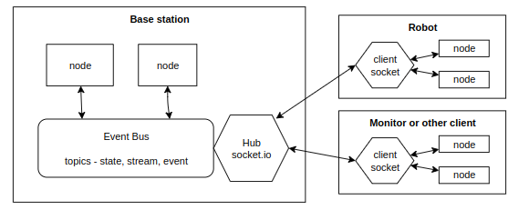

# Dave's ROS
Inspired by [dfdx labs](https://dfdxlabs.com/research/2026/robotics-setup/#software-setup ) design a new framework  which is primarily an in-memory event bus but with websocket/socket.io support for comms to robot and/or to other processes.

## Event bus
In-memory bus which manages all message routing and state management.

Nodes can *subscribe* to topics and receive messages and/or can *publish* messages to a topic. Published messages are received by every subscribing node which triggers a method.

Built in socket.io server which acts a hub. External clients can _connect_ to the Hub, can _subscribe_ to messages on a topic and can _publish_ message to a topic.  Messages send to a topic will be forwarded to any and each subscribing external client as well as in-process nodes.
## Topics and state
Topics are implicitly declared by any subscription or publication.

By default topics are type _event_. A message to the topic is sent to each subscriber (local or remote) and no state is kept.

A topic can be set to be type _state_. State topics keep the most recently seen message and clients can query for the "current" state (in a thread safe manner) without necessarily having to subscribe. This allows nodes to inspect state from multiple services without having to individually track them. A state topic can be given a history limit count so it stores the last N messages. This allows algorithms that want to look for changes or trends to easily do so.

There are some reserved topic names:
- `startup` is sent by the bus on system start up to all registered nodes
- `shutdown` is sent by the bus on system shutdown to all registered nodes
- `tick` is sent to any scheduled nodes which have registered to receive regular notifications 

## Messages
*Messages* are python dicts with string keys and element values that are permitted by socket.io, at least str, list and nested dict. 

*Are numbers allowed? Should be, and thought that was working, but not listed in socket.io docs.*

## Threading model
Use threading rather then async throughout. This side steps all the pain of linking an async framework to systems that are threaded (like audio I/O) and means that some nodes can be computationally intensive without blocked everything.

Subscribers and implement either `stream` or `event` based processing.

For stream processing the subscriber maintains a queue of messages and its own consumption loop (in a daemon thread) which processes the queue.

For event processing the bus will invoke a callback on a separate thread for each subscription (from a ThreadPoolExecutor). So the subscription simply provides the callback function.

## Nodes and scheduling
Any class (or function) can publish or can subscribe to messages.
However, we include a base `Node` class to provide common machinery.

The Node class maintains a reference to the bus and provides convenience methods to help with subscription and processing. At creation time it requires the `Bus` object and an optional interval for scheduled ticks.

Default methods, which can be overridden to provide node specific functionality:
- `name` - descriptive name used in log messages
- `startup()` - called when the system starts up
- `shutdown()` - called by system such down is initiated
- `process(message)` - default callback on message receipt (for nodes with a single topic subscription)
- `tick()` - call back at scheduled intervals for nodes which request this
- `subscribeStream(topic, callback)` - register to receive topic messages via a queue, sets up a node specific daemon thread which pumps the queue invoking the callback on every messages
- `subscribeEvent(topic, callback)` - register to receive topic message to act in as they arrive, the callback will be run in a thread supplied and managed by the Bus from its ThreadPool
- `publish(topic, message)` - publish message to bus and thence to all subscribers

## Hub and socket.io mapping

The Bus also acts as a socket.io server hub. Remote clients connect to the server which notes their `sid`. 

Messages from client to server are wrapped in socket.io events with optional data. The events are are:

| Type          | Arguments                      | Meaning                                                                                     |
| ------------- | ------------------------------ | ------------------------------------------------------------------------------------------- |
| `connect`     |                                | Socket.io inbuilt event, record sid                                                         |
| `subscribe`   | `topic:str`                    | Subscribe to a topic, no distinction between stream and events, up to client to handle this |
| `unsubscribe` | `topic:str`                    | Unsubscribe from a single topic                                                             |
| `disconnect`  |                                | Socket.io inbuilt event, remove all subscriptions                                           |
| `publish`     | `{topic: ..., message: {...}}` | Send a message to a topic                                                                   |
Server sends similar `publish` events when message is broadcast on a topic subscribed to by this client.